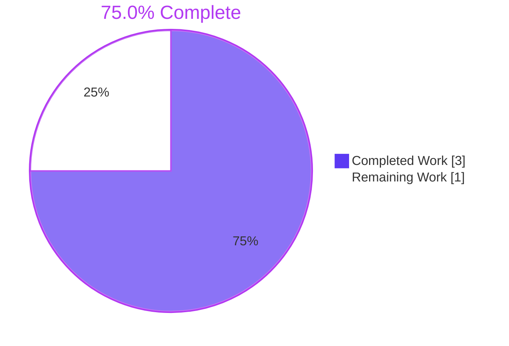
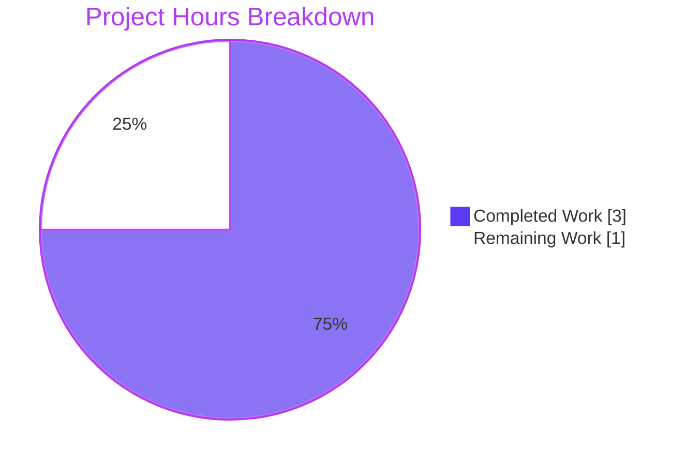
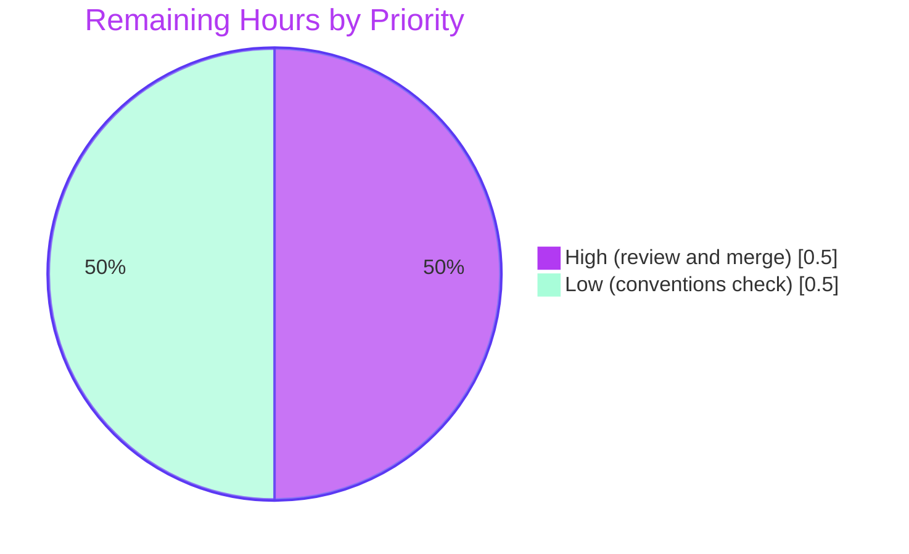

# 1. Executive Summary

## 1.1 Project Overview

BlitzyRepo1 is a single-file Node.js HTTP server (`server.js`) that answers every request on `127.0.0.1:3000` with HTTP 200 and a plain-text greeting. This project documented it: a one-line JSDoc summary above the request handler, and a `README.md` holding only the project name, the install statement and the run command. The audience is any developer who clones the repository and needs to know what the server does and how to start it. Scope was deliberately minimal, two files with no logic change and no new dependencies. The result is faster onboarding at zero runtime risk.

## 1.2 Completion Status



| Metric | Value |
|---|---|
| Total Hours | 4.0 |
| Completed Hours (AI + Manual) | 3.0 (AI 3.0 + Manual 0.0) |
| Remaining Hours | 1.0 |
| Percent Complete | 75.0% |

3.0 hours completed out of 4.0 total hours = 75.0% complete. All 13 AAP requirements are met. The remaining 1.0 hour is human review, merge and a conventions check before release.

## 1.3 Key Accomplishments

- [x] Request handler documented by the exact AAP JSDoc line at `server.js:6`, column 0, LF-terminated
- [x] Every other byte of `server.js` identical to baseline `6482633` (1 line added, 0 removed)
- [x] `README.md` matches the AAP content block byte for byte (4 lines, 64 bytes, LF, one trailing newline)
- [x] Every claim in the JSDoc and README verified true against the running code
- [x] Runtime behaviour unchanged: responses, startup output, shutdown and error paths identical to baseline
- [x] "No install step is needed." proven by booting a clean copy with no `package.json` or `node_modules`
- [x] Change confined to the two AAP files: no tests, dependencies, lockfiles or configuration added

## 1.4 Critical Unresolved Issues

No unresolved issues identified. 0 of 13 AAP requirements remain open, and no divergence blocks release (Section 5.2). Section 3 lists the minor coverage gaps worth a glance before merge.

## 1.5 Access Issues

No access issues identified. The project needs no credentials, services, registries or third-party APIs. Building and running it requires only a local Node.js runtime.

## 1.6 Recommended Next Steps

1. [High] Review the two documentation commits (`ccf1b54`, `2625f39`), re-run the validation gate in Section 9.5, and merge into `jr-br4`.
2. [Low] Check the JSDoc line and README wording against any documentation conventions your organisation keeps outside the AAP.
3. [Low] If the server will run anywhere other than a local machine, raise a separate change for configurable host/port and an automated smoke test. Both are outside this AAP's scope.

# 2. Project Hours Breakdown

## 2.1 Completed Work Detail

| Component | Hours | Description |
|---|---|---|
| Request-handler JSDoc (`server.js:6`) | 0.5 | Read the handler, then inserted the AAP 0.4.2 summary line at column 0, directly above `const server = http.createServer((req, res) => {`, LF-terminated (AAP 0.1.1, 0.4.2, 0.7.1) |
| README rewrite (`README.md`) | 0.5 | Replaced the 13-byte, unterminated stub with the AAP 0.4.2 content block: project name, install statement and run command, each taken from the source (AAP 0.1.1, 0.4.2, 0.7.1) |
| Static conformance verification | 1.0 | Checked the exact JSDoc text and placement, that every other `server.js` byte is unchanged, the README bytes, LF endings, two-file containment, the absence of placeholders, and that each documented claim is true (AAP 0.4.2, 0.6.1, 0.6.2, 0.7.1) |
| Runtime validation | 1.0 | Compared the server with baseline across methods, paths, signals and error paths. Booted a clean copy without installing anything, ran the README run command as written, and confirmed the browser render (AAP 0.1.1, 0.2.2) |
| **Total** | **3.0** | |

## 2.2 Remaining Work Detail

| Category | Hours | Priority |
|---|---|---|
| [Path-to-production] Human review and merge of commits `ccf1b54` and `2625f39` into `jr-br4`, including one re-run of the validation gate | 0.5 | High |
| [Path-to-production] Check the JSDoc line (`server.js:6`) and `README.md` wording against any documentation conventions your organisation keeps outside the AAP. AAP 0.8 declares none | 0.5 | Low |
| **Total** | **1.0** | |

## 2.3 AAP Requirement Inventory and Calculation

| # | AAP Requirement (section) | Status | Evidence |
|---|---|---|---|
| R1 | Exact JSDoc text at column 0, directly above the handler opening (0.4.2) | Completed | `server.js:6–7` |
| R2 | No other `server.js` change; every other byte, whitespace and trailing newline preserved (0.6.2, 0.7.1) | Completed | numstat `1 0`; baseline byte comparison identical |
| R3 | Inserted line terminated with LF (0.7.1) | Completed | 0 CR bytes |
| R4 | `README.md` equals the 0.4.2 content block (0.4.2, 0.1.2) | Completed | Byte comparison exact, 64 bytes |
| R5 | `README.md` uses LF line endings (0.7.1) | Completed | 0 CR bytes, one trailing LF |
| R6 | README under 15 lines, holding only the three items (0.1.1) | Completed | 4 lines, 3 non-blank |
| R7 | No contributing, license, testing, deployment, architecture or TOC sections (0.6.2) | Completed | `README.md:1–4` |
| R8 | Only `server.js` and `README.md` changed; no tests, lockfiles or dependencies (0.6.1, 0.6.2) | Completed | Branch diff: 2 files |
| R9 | Smallest possible diff (0.1.2) | Completed | +5 / −1 lines |
| R10 | No logic change (0.1.1) | Completed | Runtime identical to baseline (Section 3) |
| R11 | No new documentation files or `docs/` tree (0.4.1, 0.5.2) | Completed | No files created |
| R12 | No documentation configuration, links, includes or TOC (0.5.4, 0.5.5) | Completed | No changes of these kinds in either file |
| R13 | No user rules apply, and nothing the request excludes was added (0.8) | Completed | AAP 0.8; both diffs |

Completed hours = 0.5 + 0.5 + 1.0 + 1.0 = 3.0. Remaining hours = 0.5 + 0.5 = 1.0. Total = 3.0 + 1.0 = 4.0. Completion = 3.0 / 4.0 × 100 = 75.0%. Estimates carry high confidence, because the scope is fully specified down to the byte.

# 3. Test Results

The repository has no automated test suite, no coverage tooling and no linter configuration, and AAP 0.6.2 excludes adding any. Every check below is a command-line validation run against HEAD `2625f39` on Node v22.23.3. Each runtime check ran in an isolated network namespace with a private `127.0.0.1:3000`.

| Area / Category | Framework | Tests | Passed | Failed | Coverage | What This Proves |
|---|---|---|---|---|---|---|
| Syntax validation | `node --check` | 1 | 1 | 0 | `server.js` (the only JS file) | The file still parses after the comment insertion |
| Whole-package smoke gate | `node` + `curl`, `unshare -n` | 1 | 1 | 0 | `GET /` | The server boots and serves the greeting with HTTP 200 |
| Response-contract parity with baseline `6482633` | `curl` + `diff` | 38 (19 per revision) | 38 | 0 | 6 methods × 3 paths (incl. an unknown path) with a JSON body, plus `HEAD` | Every request gets 200, `text/plain` and the 34-byte greeting, identical to the pre-change server once `Date` headers are removed |
| Lifecycle parity | shell + `diff` | 3 | 3 | 0 | Startup stdout, stderr, SIGTERM exit code | Startup output and shutdown (exit 143) are unchanged |
| Environment binding | `curl` | 2 | 2 | 0 | `PORT=4123 HOST=0.0.0.0` | No environment-variable configuration was introduced: `:3000` answers and `:4123` is refused |
| Static AAP conformance | `git diff`, `cmp`, `grep`, `wc` | 9 | 9 | 0 | Both changed files and the branch diff | JSDoc text and placement exact, all other bytes unchanged, README byte-exact, LF only, no markers, only two files changed |
| Documented flow and failure modes | shell + `curl` | 5 | 5 | 0 | README run command, `POST /any/path`, alternate-port shim, second instance, wrong working directory | The README command boots and stops the server. Each failure mode in Section 9.7 behaves as documented |

Totals: 59 checks run, 59 passed, 0 failed.

**Not Covered**

- **Automated regression tests:** none exist, so future edits to `server.js` are unguarded. The AAP excludes tests from this change.
- **README rendering on your Git host:** `README.md` was verified byte by byte, not as rendered Markdown. Glance at it in the pull request view.
- **Node.js 20.x:** every check ran on v22.23.3. The code uses only the built-in `http` module, so 20.x is expected to behave the same, but it was not exercised.
- **Organisation documentation conventions:** wording was checked against the AAP only. AAP 0.8 declares no user rules (task in Section 2.2).

# 4. Runtime Validation & UI Verification

The server has no UI beyond a `text/plain` response, no authentication and no external integrations. The status lines below describe what was driven at runtime.

- ✅ **Startup:** `node server.js`, run from the repository root, logs `Server running at http://127.0.0.1:3000/` and listens only on `127.0.0.1:3000`.
- ✅ **Request handling:** every method and path tested returns `HTTP/1.1 200 OK`, `Content-Type: text/plain`, `Content-Length: 34` and `Hello, World Welcome to Sharebot!`. Unknown paths answer 200, and `HEAD` returns headers only. This matches the JSDoc at `server.js:6`.
- ✅ **No logic change:** responses, startup output, stderr and exit codes are identical to baseline `6482633` across method/path matrices, concurrent bursts of 50 and 200 requests, and keep-alive reuse.
- ✅ **README install statement:** a clean copy of the tracked files, with no `package.json` or `node_modules`, boots and serves under an empty environment (`env -i`).
- ✅ **README run command:** the command taken verbatim from `README.md:4` boots the server, which then serves the greeting.
- ✅ **Browser render:** Chrome shows the greeting as plain text. Every page request (`/`, `/favicon.ico`) returns 200, and the console logs 0 messages.
- ✅ **Shutdown:** SIGTERM exits 143 and SIGINT exits 130. Both free the port, matching baseline.
- ✅ **Error paths:** Node's built-in parser answers malformed requests with 400 and oversized headers with 431, byte-identical to baseline. The server keeps serving afterwards.
- ✅ **Configuration:** `PORT`, `HOST` and `HOSTNAME` are ignored, as at baseline, so no environment configuration was added (AAP 0.6.2).
- ⚠ **Working directory:** `node server.js` run outside the repository root fails with `Cannot find module`. The README assumes the root, and AAP 0.6.2 forbids adding wording to it.

Nothing in AAP scope went unexercised at runtime.

# 5. Compliance & Quality Review

## 5.1 Compliance Matrix

| # | Deliverable / Benchmark | AAP Source | Status | Progress | Evidence |
|---|---|---|---|---|---|
| 1 | JSDoc text, column and placement | 0.4.2 | ✅ PASS | 100% | `server.js:6–7` |
| 2 | `server.js` otherwise byte-identical | 0.6.2, 0.7.1 | ✅ PASS | 100% | numstat `1 0`; baseline comparison identical |
| 3 | README content block | 0.4.2, 0.1.2 | ✅ PASS | 100% | Byte comparison exact, 64 bytes |
| 4 | README length and permitted items only | 0.1.1, 0.6.2 | ✅ PASS | 100% | 4 lines, 3 items, no excluded sections |
| 5 | LF line endings and trailing newline | 0.7.1 | ✅ PASS | 100% | 0 CR bytes in either file |
| 6 | Two-file scope containment | 0.6.1, 0.6.2 | ✅ PASS | 100% | Branch diff: `README.md`, `server.js` only; `LICENSE` unchanged |
| 7 | No logic or runtime change | 0.1.1 | ✅ PASS | 100% | Baseline parity (Sections 3 and 4) |
| 8 | Documentation accuracy | 0.2.2 | ✅ PASS | 100% | JSDoc and all three README claims hold against the running code |
| 9 | Zero placeholders, TODO or FIXME markers | Blitzy standard | ✅ PASS | 100% | Marker sweep of both files: none |
| 10 | Security: no secrets and no new attack surface | Blitzy standard | ✅ PASS | 100% | Comment and Markdown only; no new input handling or dependency |
| 11 | Syntax and build validity | Blitzy standard | ✅ PASS | 100% | `node --check server.js` exit 0 |
| 12 | Automated test coverage | 0.6.2 excludes tests | ⚪ N/A | — | No test suite exists or was in scope |

## 5.2 AAP & Rule Divergences and Gaps

No divergences from the Agent Action Plan or user rules were identified.

Basis: all 13 requirements in Section 2.3 were checked against the files as they stand at HEAD `2625f39`. So were the AAP's section-level assertions across sections 0.1–0.9, and every one matches. AAP 0.8 declares no user-specified rules. The branch changes exactly the two files the AAP names, and in each only the change AAP 0.4.2 states. Three points of interpretation were settled by the AAP itself, so none of them is a departure:

- **"3 lines" versus a 4-line block.** AAP 0.4.2 describes `README.md` as "3 lines", but its content block has four physical lines: heading, blank separator and two text lines. AAP 0.1.2 makes the exact block the acceptance criterion, and the file matches it byte for byte.
- **JSDoc attachment.** Syntactically, the comment at `server.js:6` documents the `const server` declaration rather than the arrow callback inside it. AAP 0.4.2 mandates that placement, and the summary is accurate for both.
- **Working directory for the run command.** `README.md:4` assumes the command runs from the repository root. AAP 0.6.2 forbids README content beyond the three items, so the qualifier was not added.

# 6. Risk Assessment

The delivered change is a comment and a Markdown file, so it adds no new production risk. The risks below come from the existing server, which AAP 0.6.2 deliberately leaves unchanged. Address them only through a separate change request.

| Risk | Category | Severity | Probability | Mitigation | Status |
|---|---|---|---|---|---|
| No automated test suite guards future edits to `server.js` | Technical | Medium | Medium | Add the Section 9.5 gate as a CI smoke test in a future change | Open, outside AAP scope |
| Host and port are hardcoded to `127.0.0.1:3000` (`server.js:3–4`), so the server is unreachable from containers or other hosts | Integration | Medium | Medium if deployed | Make host/port configurable before any non-local deployment | Accepted, AAP 0.6.2 |
| A second instance on a held port crashes with an unhandled `EADDRINUSE` (exit 1) | Operational | Low | Low | Run one instance per port; add a listener `error` handler in a future change | Accepted, AAP 0.6.2 |
| No health endpoint, request logging or graceful shutdown | Operational | Low | Medium | Add these only if the server becomes a monitored service | Accepted, AAP 0.6.2 |
| No security headers, and `Content-Type: text/plain` has no charset (browsers fall back to a default encoding; the ASCII body renders correctly) | Security | Low | Low | Set headers and `charset=utf-8` if the body ever carries non-ASCII or user data | Accepted, AAP 0.6.2 |
| `node server.js` fails with `Cannot find module` outside the repository root | Integration | Low | Low | Run from the root (Section 9.4), or use an absolute path | Accepted, AAP 0.6.2 |
| JSDoc and README state behaviour literally (HTTP 200, plain text, no install step) and will go stale if routes or dependencies are added | Technical | Low | Low | Update `server.js:6` and `README.md` alongside any behaviour or dependency change | Monitor |
| No `package.json` `engines` pin; verified on Node v22.23.3 only | Technical | Low | Low | Use Node ≥ 20.20.2 (20.x) or ≥ 22.12.0 (22.x) | Monitor |

# 7. Visual Project Status





| Category (Section 2.2) | Hours | Priority |
|---|---|---|
| Human review and merge | 0.5 | High |
| Conventions check | 0.5 | Low |
| **Remaining total** | **1.0** | |

Completed work (Dark Blue `#5B39F3`) is 3.0 hours and remaining work (White `#FFFFFF`) is 1.0 hour, so the project is 75.0% complete.

# 8. Summary & Recommendations

The project delivered both AAP documentation changes exactly as specified. `server.js:6` now carries the one-line summary `/** Responds to every request with HTTP 200 and a plain-text greeting. */` directly above the request handler, and every other byte of the file is identical to baseline `6482633`. `README.md` now holds the project name, "No install step is needed." and "Run: `node server.js`", matching the AAP 0.4.2 content block byte for byte. The branch touches only these two files (+5 / −1 lines).

Verification covered both what the files say and what the code does. Static checks confirm the exact text, placement, LF endings and scope containment. Runtime checks show the server's responses, startup output, shutdown codes and error paths are identical to the pre-change baseline. The README's two practical claims hold: a clean copy boots with no install step, and the documented command starts the server. All 59 checks in Section 3 passed, and Chrome renders the greeting as plain text with zero console messages.

The project is 75.0% complete: 3.0 of 4.0 hours delivered. All 13 AAP requirements are met, and no divergence from the AAP or user rules exists. The remaining 1.0 hour is path-to-production work for a human: review and merge the two commits (0.5 h, High), and check the wording against any organisation documentation conventions outside the AAP (0.5 h, Low).

The critical path is short. Re-run the Section 9.5 gate, review the two diffs and merge into `jr-br4`. Success means `node --check` and the gate exit 0, `git diff --numstat 6482633 -- server.js` shows `1 0`, and `README.md` matches the AAP block.

Production readiness: ready to merge as written. The change adds no runtime risk, because no executable line changed. The risks in Section 6 belong to the existing server, notably the hardcoded `127.0.0.1:3000` and the absence of tests. AAP 0.6.2 places them outside this change. Raise a separate change request before deploying the server beyond a local machine.

# 9. Development Guide

## 9.1 System Prerequisites

- Node.js ≥ 20.20.2 (20.x line) or ≥ 22.12.0 (22.x line). Verified on v22.23.3.
- `curl`, for checking responses.
- Optional, for the isolated validation gate: Linux with `unshare` (util-linux) and `ip` (iproute2), run as root.
- Any OS that runs Node.js. The server uses about 48 MB of memory.

## 9.2 Environment Setup

No virtual environment, environment variables, services or secrets are needed. The server reads no environment variables, and its host and port are fixed in `server.js:3–4`.

```bash
cd <path-to>/BlitzyRepo1     # every command below runs from the repository root
node --version               # expect v20.20.2+ or v22.12.0+
```

## 9.3 Dependency Installation

None. `server.js` requires only Node's built-in `http` module (`server.js:1`). There is no `package.json`, and `npm install` is not needed.

## 9.4 Application Startup

```bash
node server.js
```

Expected output:

```
Server running at http://127.0.0.1:3000/
```

The server listens only on `127.0.0.1:3000`. Stop it with `Ctrl+C` (SIGINT, exit 130) or `kill <pid>` (SIGTERM, exit 143).

## 9.5 Verification Steps

Syntax check:

```bash
node --check server.js && echo "syntax OK"
```

Isolated smoke gate. It starts the server in a private network namespace, so it never touches your host's port 3000:

```bash
node --check server.js && timeout 30 unshare -n sh -c 'ip link set lo up; node server.js >/dev/null 2>&1 & P=$!; for i in $(seq 20); do curl -sf -o /dev/null http://127.0.0.1:3000/ && break; sleep 0.2; done; curl -sf -w "HTTP %{http_code}\n" http://127.0.0.1:3000/; R=$?; kill $P; exit $R'
```

Expected output, exit 0:

```
Hello, World Welcome to Sharebot!
HTTP 200
```

AAP conformance checks:

```bash
git diff --numstat 6482633 -- server.js        # expect: 1  0  server.js
sed 6d server.js | cmp - <(git show 6482633:server.js) && echo "server.js otherwise unchanged"
printf '%s\n' '# BlitzyRepo1' '' 'No install step is needed.' 'Run: `node server.js`' | cmp - README.md && echo "README exact"
```

## 9.6 Example Usage

With the server running, in a second terminal:

```bash
curl -i http://127.0.0.1:3000/
```

```
HTTP/1.1 200 OK
Content-Type: text/plain
Connection: keep-alive
Keep-Alive: timeout=5
Content-Length: 34

Hello, World Welcome to Sharebot!
```

Every method and path receives the same response:

```bash
curl -s -X POST -d 'x' http://127.0.0.1:3000/any/path    # Hello, World Welcome to Sharebot!
```

## 9.7 Troubleshooting

- **`Error: listen EADDRINUSE: address already in use 127.0.0.1:3000`, exit 1.** Another process holds port 3000. Find it with `ss -ltnp 'sport = :3000'` and stop it, or run on another port without editing `server.js`:

  ```bash
  node -e "const n=require('net'),L=n.Server.prototype.listen;n.Server.prototype.listen=function(p,...r){return L.call(this,13000+Number(process.argv[1]),...r)};require('./server.js')" 0
  ```

  This serves on `http://127.0.0.1:13000/`. The startup log still reads `:3000`, because that message is hardcoded.
- **`Error: Cannot find module '.../server.js'`, exit 1.** You ran the command outside the repository root. `cd` to the root, or pass an absolute path: `node /full/path/to/server.js`.
- **`unshare` fails with `Operation not permitted`.** The isolated gate needs root. Prefix it with `sudo`, or use the startup and `curl` steps in 9.4 and 9.6 instead.
- **Browser shows the greeting for `/favicon.ico` too.** This is expected: the handler answers every path.

# 10. Appendices

## A. Command Reference

| Purpose | Command (from repository root) | Expected Result |
|---|---|---|
| Run the server | `node server.js` | `Server running at http://127.0.0.1:3000/` |
| Syntax check | `node --check server.js` | Exit 0, no output |
| Smoke request | `curl -i http://127.0.0.1:3000/` | `HTTP/1.1 200 OK`, greeting body |
| Isolated gate | See Section 9.5 | Greeting, then `HTTP 200`, exit 0 |
| JSDoc diff size | `git diff --numstat 6482633 -- server.js` | `1  0  server.js` |
| README diff size | `git diff --numstat 6482633 -- README.md` | `4  1  README.md` |
| Branch commits | `git log --oneline origin/jr-br4..HEAD` | `2625f39`, `ccf1b54` |

## B. Port Reference

| Port | Bind Address | Purpose | Configurable |
|---|---|---|---|
| 3000 | `127.0.0.1` | HTTP server (`server.js:3–4`) | No, hardcoded |
| 13000 + n | `127.0.0.1` | Optional alternate port through the Section 9.7 shim | Through the shim argument `n` |

## C. Key File Locations

| Path | Role | Changed |
|---|---|---|
| `server.js` | HTTP server; JSDoc at line 6, handler at lines 7–11, listener at lines 13–15 | Yes, +1 line |
| `README.md` | Project name, install statement, run command | Yes, rewritten (4 lines) |
| `LICENSE` | Apache License 2.0 | No |

## D. Technology Versions

| Technology | Version | Notes |
|---|---|---|
| Node.js | v22.23.3 (verified) | Supported: ≥ 20.20.2 (20.x) or ≥ 22.12.0 (22.x) |
| `http` module | Node built-in | The only dependency |
| Third-party packages | None | No `package.json` or lockfile |

## E. Environment Variable Reference

The server reads no environment variables. `PORT`, `HOST` and `HOSTNAME` are verified to have no effect.

## F. Developer Tools Guide

| Task | Tool / Command |
|---|---|
| Inspect the delivered change | `git diff 6482633 -- server.js README.md` |
| Show line endings and whitespace | `cat -A server.js README.md` |
| Count CR bytes (expect 0) | `grep -c $'\r' server.js README.md` |
| Check whitespace errors | `git diff --check 6482633` |
| Sweep for placeholders (expect no output) | `grep -nE 'TODO\|FIXME\|XXX\|HACK\|TBD' server.js README.md` |

## G. Glossary

| Term | Meaning |
|---|---|
| AAP | Agent Action Plan, the specification this change implements |
| JSDoc | The `/** ... */` documentation-comment convention for JavaScript |
| Baseline `6482633` | The commit before this change, used as the comparison point for parity |
| Network namespace (`unshare -n`) | An isolated network stack with its own loopback, used to run the server without binding the host's port 3000 |
| LF | Line feed (`\n`), the only line ending used in both files |
