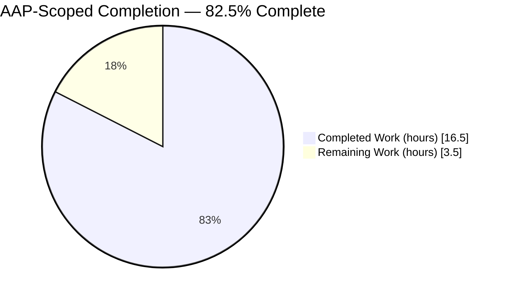
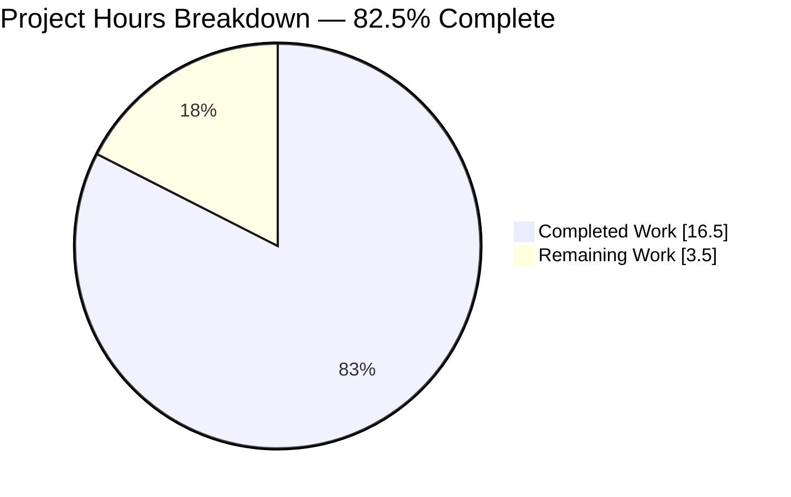
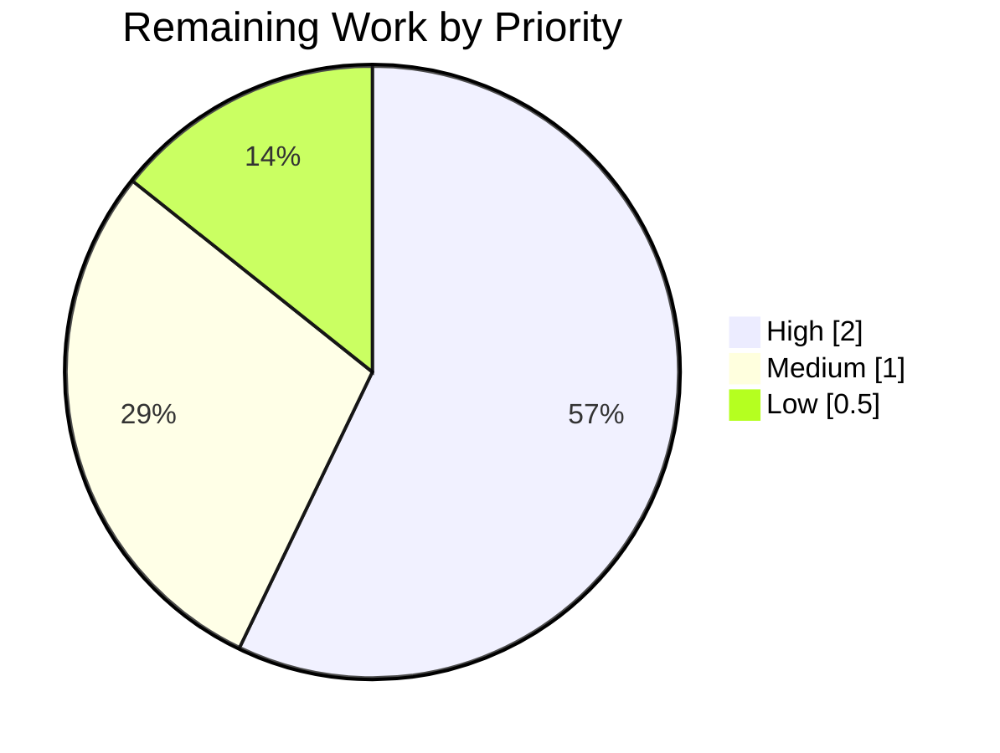
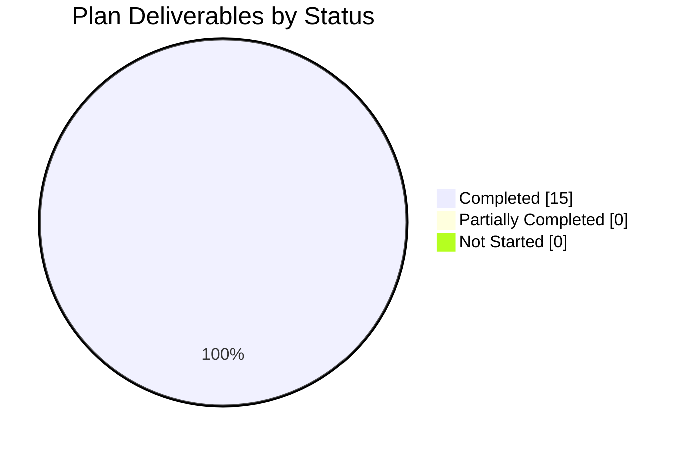

# 1. Executive Summary

## 1.1 Project Overview

BlitzyRepo1 is a single-file, zero-dependency Node.js service answering every request on `127.0.0.1:3000` with a fixed plain-text greeting. This work took its in-source documentation from nothing to complete — every callable unit and every piece of functionality in `server.js` now carries a comment — and committed the supplied reference screenshot into the repository, without changing one executable line. Those comments are now the only written statement of its HTTP contract, startup lifecycle and configuration.

## 1.2 Completion Status



Chart colours: Completed = Dark Blue `#5B39F3`; Remaining = White `#FFFFFF`.

| Metric | Value |
|---|---|
| Total Hours | 20.0 |
| Completed Hours (AI + Manual) | 16.5 (AI 16.5, Manual 0.0) |
| Remaining Hours | 3.5 |
| Percent Complete | 82.5% |

Calculation: 16.5 ÷ (16.5 + 3.5) = **82.5%**, counting only plan-scoped and path-to-production work. All 15 plan deliverables are complete; what remains is owner sign-off, provenance confirmation and publication.

## 1.3 Key Accomplishments

- ✅ Both callable units documented — 2 of 2 — as `@callback` typedefs (`server.js:36-48`, `:64-71`)
- ✅ All nine non-callable functionality units commented, plus a `@file`/`@module` header — 12 blocks
- ✅ Behaviour proven unchanged: 63 insertions, 0 deletions, identical 40-token executable stream
- ✅ Startup output (41 B) and HTTP response (146 B) byte-identical before and after, on Node 22 and 24
- ✅ Supplied screenshot committed as a tracked 55,895-byte PNG, rendering confirmed from the README
- ✅ One `## Reference material` section added to `README.md`, `# BlitzyRepo1` title preserved
- ✅ `LICENSE` byte-identical; tree still 4 files, 1 directory, zero dependencies, no build step
- ✅ Every literal the comments quote checked against the code beneath it

## 1.4 Critical Unresolved Issues

Both requirements in the request are met and **0 of 15** plan deliverables remain open. The rows below are release steps only the repository owner can perform.

| Issue | Impact | Owner | ETA |
|---|---|---|---|
| Comment accuracy has no automated gate — no test suite, linter or doc check exists here, and adding one is out of scope | A later edit to `server.js` can silently outdate a comment with nothing to catch it | Repository owner | 0.5 h |
| The committed reference image cannot be compared against your own copy of the attachment in this environment | Provenance rests on byte count, digest and PNG structure rather than a direct comparison with your file | Repository owner | 0.5 h |
| The branch exists locally only, so the README's reference section has not been seen rendered on the repository host | The image path is a bare relative link and renders locally; host rendering is unconfirmed until publication | Repository owner | 1.0 h |
| The published behaviour-preservation command is anchored to `HEAD`, which now carries documentation | Run as written on a clean tree it exits 1; the correct anchor is the pre-documentation baseline `6482633` | Repository owner | 0.5 h |

## 1.5 Access Issues

| System/Resource | Type of Access | Issue Description | Resolution Status | Owner |
|---|---|---|---|---|
| Supplied attachment `Screenshot 2026-09-11 at 16.52.27.png` | Source file access | The original file is not present in this environment, so a direct byte comparison against the committed asset is not runnable here | Resolved for delivery — the committed PNG is 55,895 bytes with sha256 `577f5e9c7339d7a92c370ccaf89bb8e5b0e2819107e3a40e475a7c4fbacc9970`, valid chunk CRCs and no bytes after IEND; open for owner confirmation | Repository owner |
| `origin` remote (`github.com/rjhonsi/BlitzyRepo1`) | Push / pull-request permission | The branch `blitzy-7840c544-dc32-4136-95c1-a326a0127d77` has not been published, so host-side rendering and pull-request review have not happened | Open — requires a push by an account with write access | Repository owner |

No other access issue: the service needs no credentials, variables, database or network egress.

## 1.6 Recommended Next Steps

1. **[High]** Sign off the 63 added comment lines — `git diff 6482633 HEAD -- server.js` (0.5 h).
2. **[High]** `cmp` the committed image against your copy of the attachment (0.5 h).
3. **[High]** Publish the branch, open and merge the pull request (1.0 h).
4. **[Medium]** Confirm the Reference material image renders on the repository host (0.5 h).
5. **[Medium]** Note in contributor guidance that the invariance check anchors to `6482633`, not `HEAD` (0.5 h).

# 2. Project Hours Breakdown

## 2.1 Completed Work Detail

| Component | Hours | Description |
|---|---|---|
| In-source documentation of `server.js` | 5.0 | Twelve documentation blocks over eleven functionality units plus the file-level header: `@file`/`@module` header (`:1-14`), `@constant` blocks for `hostname`, `port` and `server` (`:19-25`, `:28-33`, `:50-54`), `@callback` typedefs for the request handler and readiness callback (`:36-48`, `:64-71`), and six `//` statement comments (`:16`, `:56`, `:58`, `:60`, `:73`, `:75`). Includes selecting and applying one convention across the file and two corrections to the startup-lifecycle wording |
| Reference asset delivery | 2.5 | Obtaining the supplied attachment, committing it byte-exact at `assets/reference-screenshot-2026-09-11.png` — the repository's first directory — and verifying size, digest, PNG structure, absence of trailing payload, file mode and git tracking |
| `README.md` reference-material section | 0.5 | One `## Reference material` section with the exact image embed and a single provenance sentence, preserving the `# BlitzyRepo1` title and handling the file's missing trailing newline |
| Behaviour-preservation gate | 2.5 | Recovering the pre-documentation revision, capturing startup output and the `Date`-normalized HTTP response before and after on two runtimes, and proving executable content unchanged through a comment-stripped token comparison with a negative control |
| Documentation coverage and accuracy verification | 1.5 | Tag inventory, literal census, placement and indentation checks, the twelve-block unit-to-block mapping, and sweeps confirming no aspirational content, no TODO markers and no claim derived from the reference image |
| Runtime and browser verification | 3.5 | HTTP probe matrix across methods and paths, HEAD framing, lifecycle and failure modes (load-time side effect, empty exports, port collision, SIGTERM), concurrency and log-stream stability, plain-text rendering and reference-image rendering in a browser, and adversarial input probes |
| Repository shape and invariant verification | 1.0 | Four-file/one-directory tracked tree, `LICENSE` byte-identity, and confirmation that no manifest, lockfile, `node_modules`, linter, formatter, test suite, CI workflow or ignore file was introduced |
| **Total** | **16.5** | Matches Completed Hours in Section 1.2 |

## 2.2 Remaining Work Detail

| Category | Hours | Priority |
|---|---|---|
| Owner sign-off read of the 63 added comment lines against the code | 0.5 | High |
| Provenance confirmation: compare the committed reference image against your copy of the attachment | 0.5 | High |
| Publish the branch, open and merge the pull request | 1.0 | High |
| Confirm the README reference-material section renders on the repository host | 0.5 | Medium |
| Record the baseline-anchored executable-invariance command in contributor guidance | 0.5 | Medium |
| Working-tree hygiene: keep the untracked browser-evidence images out of the delivered tree | 0.5 | Low |
| **Total** | **3.5** | Matches Remaining Hours in Section 1.2 and the pie chart in Section 7 |

## 2.3 Hours Reconciliation

| Check | Value |
|---|---|
| Section 2.1 completed total | 16.5 |
| Section 2.2 remaining total | 3.5 |
| Sum (equals Total Hours in Section 1.2) | 20.0 |
| Completion percentage (16.5 ÷ 20.0 × 100) | 82.5% |

Confidence: **high** for every completed line — each is a delivered artifact in the tree, verified by a command whose result was observed. Confidence is high for the remaining lines as well; they are small, well-defined owner actions with no unknown dependencies. Nothing in the plan's scope is estimated on speculation.

# 3. Test Results

Every row below was executed against this branch and its result observed directly. The repository ships no test suite — that is a requirement of the project, not an omission — so the verification is the repository's own parse gate, the bundled Node test runner, and explicit assertion checks over behaviour, documentation and artifacts.

| Area / Category | Framework | Tests | Passed | Failed | Coverage | What This Proves |
|---|---|---|---|---|---|---|
| Syntax parse gate | `node --check` | 2 | 2 | 0 | `server.js` — the only `.js` file | The documented file still parses on Node 22.23.2 and Node 24.21.0 |
| Bundled test runner | `node --test` | 0 | 0 | 0 | No suite ships, by requirement | The runner exits clean with zero tests discovered; there is no automated behavioural coverage to regress |
| Behaviour preservation | Capture harness + `cmp` | 4 | 4 | 0 | Startup stream and full HTTP response | Startup output (41 bytes) and the `Date`-normalized response (146 bytes) are byte-identical to the pre-documentation revision |
| Executable invariance | Comment-stripped token comparison + `git numstat` | 5 | 5 | 0 | All 14 original executable lines | Not one executable token changed: 63 insertions, 0 deletions, 40-token streams identical, every original line present verbatim and in order |
| Documentation coverage census | `grep`/`awk` assertions | 19 | 19 | 0 | 12 of 12 units (11 functionality units + file header) | Every unit carries its comment in the prescribed form, with the exact tag inventory, all six literals quoted verbatim, and no TODO or aspirational content |
| Artifact and repository integrity | Shell assertions | 17 | 17 | 0 | All 4 tracked files and the tree shape | The reference image is a tracked 55,895-byte PNG, the README embed line matches exactly, the title is preserved, `LICENSE` is byte-identical, and no manifest, lockfile or tooling file was introduced |
| HTTP contract probes | `curl` matrix | 9 | 9 | 0 | 8 method/path shapes plus HEAD | Every method and path returns `200` / `text/plain` / `Content-Length: 34` with a single body digest, and HEAD returns headers only |
| Lifecycle and failure modes | Node/shell harnesses | 4 | 4 | 0 | Load, collision, logging, shutdown | `require()` yields an empty object and then the service starts; a taken port aborts with exit 1; stdout stays one 41-byte line under traffic; SIGTERM releases the port |
| **Total** | — | **60** | **60** | **0** | — | — |

**Not Covered.** These are delivered behaviours that no test exercises, and what to check before release:

- **Truth of the comment text.** Comments are inert; no parse gate, test or lint rule can assert that a sentence about the HTTP contract or the startup lifecycle is correct, and the project forbids introducing a tool that could. Read the 63 added lines against the code once (Section 2.2, 0.5 h).
- **Markdown rendering on the repository host.** The reference image was confirmed to load and render in a browser, but the README has not been viewed on the hosting platform because the branch is unpublished. Check it immediately after publishing.
- **Provenance against your own copy of the attachment.** Size, digest, PNG structure and the absence of any trailing payload were all verified; a direct byte comparison with your original file was not possible here.
- **No automated safety net for future edits to `server.js`.** With no unit or integration tests for the handler — forbidden by scope — any later change to the executable code is unguarded. The comment-stripped token comparison in Section 9 is the substitute to run on every future comment-only edit.
- **Sustained load and long-run behaviour.** Concurrency to 100 simultaneous requests and keep-alive idle timeout behaved correctly with no descriptor growth; no soak test, throughput baseline or memory profile exists.

# 4. Runtime Validation &amp; UI Verification

Every line below was driven against a live instance started with `node server.js` from the repository root — no install step and no build step.

- ✅ **Cold start** — the service was ready on the first readiness poll; stdout carried exactly one 41-byte line, `Server running at http://127.0.0.1:3000/`, and stderr stayed empty.
- ✅ **Greeting endpoint** — `GET /` returned `HTTP/1.1 200 OK`, `Content-Type: text/plain`, `Content-Length: 34` and the 34-byte body `Hello, World Welcome to Sharebot!` (digest `6bdf54b210306090…`).
- ✅ **Method and path indifference** — 8 probes (`GET /`, `POST /submit`, `PUT /x`, `DELETE /y`, `GET /health`, `GET /favicon.ico`, a script payload in the query string, and a traversal path) all returned the identical 200 response with one body digest; there is no routing and no 404 path.
- ✅ **HEAD framing** — `HEAD /` returned 200 with headers only and zero body bytes, the runtime suppressing the body as expected.
- ✅ **Browser rendering of the response** — Chrome showed `document.contentType = text/plain`, a DOM consisting only of its plain-text viewer (`HTML, HEAD, META, BODY, PRE`) with zero `script`, `img`, `h1` or `b` elements, and no console messages or failed requests.
- ✅ **Query-string payload probe** — `/unknown-path?q=<script>alert(1)</script>` rendered the identical page, raised no dialog under a pre-load `alert`/`confirm`/`prompt` hook, and the payload was absent from the DOM in all search forms; the handler reads nothing from the request.
- ✅ **Reference image rendering** — the committed PNG loaded from its repository path with `complete=true`, intrinsic size 1928×198, `decode()` resolved, a 200 `image/png` response whose bytes were digest-identical to the committed asset, exact alt text exposed, and zero console errors.
- ✅ **Load-time side effect and empty exports** — requiring the module printed an empty exports object *before* the startup line and the service then answered `200`/`text/plain`/34, matching what the file header documents.
- ⚠ **Port collision** — a second instance while the first held the port exits 1 with empty stdout and a 626-byte unhandled `EADDRINUSE` stack trace on stderr. This is the documented behaviour of unchanged code: there is no error handling, by scope.
- ✅ **Shutdown** — SIGTERM stopped the process and released port 3000 immediately, with nothing further written to either stream.

**Never exercised at runtime.** Markdown rendering on the repository host, because the branch is unpublished — rendering was confirmed only in a local browser. The comment text itself has no runtime surface and was verified by reading. There is no authentication, database, queue, cache, outbound integration or user interface in this project to exercise: the service ships no HTML, CSS or client-side JavaScript, and the reference image is documentation rather than an interface.

# 5. Compliance &amp; Quality Review

## 5.1 Compliance Matrix

| # | Deliverable / Benchmark | Status | Progress | Verified By |
|---|---|---|---|---|
| 1 | Reference image committed byte-exact and tracked at `assets/reference-screenshot-2026-09-11.png` | ✅ PASS | 100% | 55,895 bytes; sha256 `577f5e9c7339…`; `image/png` 1928×198 RGBA; `git ls-files --error-unmatch` exit 0; sole entry in `assets/` |
| 2 | Image embedded from `README.md` with the required alt text | ✅ PASS | 100% | Whole-line fixed-string match on `README.md:5`, exactly once; case-exact bare relative path; rendered in a browser |
| 3 | Both callable units documented as `@callback` typedefs | ✅ PASS | 100% | `RequestHandler` `server.js:36-48` (2 `@param`, `@returns {void}`); `ReadyCallback` `server.js:64-71` (`@returns {void}`) |
| 4 | Nine non-callable functionality units commented | ✅ PASS | 100% | `server.js:16`, `:19-25`, `:28-33`, `:50-54`, `:56`, `:58`, `:60`, `:73`, `:75` |
| 5 | File-level `@file`/`@module` header stating the load-time side effect and absent exports | ✅ PASS | 100% | `server.js:1-14`; confirmed at runtime — `require()` returns `{}` and the service starts |
| 6 | One consistent convention: JSDoc blocks on symbols, `//` lines on bare statements | ✅ PASS | 100% | 6 JSDoc blocks and exactly 6 physical `//` lines at indents {0, 2, 2, 2, 0, 2}; no trailing or third-form comments |
| 7 | All six mandated literals quoted verbatim in the comments | ✅ PASS | 100% | `'127.0.0.1'`, `3000`, `200`, `'Content-Type'`, `'text/plain'`, `'Hello, World Welcome to Sharebot!\n'` — each present on the block documenting its line |
| 8 | No aspirational content, TODO markers or claim derived from the reference image | ✅ PASS | 100% | Sweeps for `process.env`, `module.exports`, `SIGTERM`, `EADDRINUSE`, `graceful`, `middleware`, `authenticat`, `TODO`/`FIXME` all return nothing |
| 9 | Comment-only change: additions only, zero deletions | ✅ PASS | 100% | `git diff --numstat 6482633 HEAD -- server.js` = `63  0`; every added line a comment or blank |
| 10 | Executable content and runtime behaviour unchanged | ✅ PASS | 100% | 40-token comment-stripped streams identical; startup (41 B) and HTTP (146 B) captures `cmp`-identical on Node 22 and 24 |
| 11 | `README.md` title preserved; `LICENSE` byte-identical; tree of 4 files and 1 directory | ✅ PASS | 100% | `head -c 13` = `# BlitzyRepo1`; `LICENSE` sha256 `c71d239df917…`; `git ls-files` returns exactly 4 paths |
| 12 | Zero-dependency, install-free, build-free character preserved (user rule JR_Rule1 coverage and presentation) | ✅ PASS | 100% | No manifest, lockfile, `node_modules`, linter, formatter, test suite, CI workflow or ignore file present or added; 12 of 12 units carry a comment adjacent to its subject |

## 5.2 AAP &amp; Rule Divergences and Gaps

Three divergences from the plan of record as written were identified. There is **no divergence from the user-specified rule**: JR_Rule1 requires clean code with a comment on each piece of functionality written, and both obligations are met — 12 of 12 units covered, one convention throughout, every comment adjacent to its subject, and no restatement of syntax.

| What the AAP/Rule Required | What Was Delivered Instead | Why It Diverged | Impact | Remediation |
|---|---|---|---|---|
| The file header must state that requiring or executing the module "binds the listener as a load-time side effect" | The header says "starting the listener is a load-time side effect", states that `server.listen` is asynchronous, and reserves "bound and listening" for the readiness callback (`server.js:3-11`) | The literal wording would have been false: `listen` is asynchronous and the socket is not necessarily accepting connections when `require()` returns | None adverse — the delivered text is strictly more accurate, and every mandated assertion of the header is present | None required; accept the wording at sign-off |
| The behaviour-preservation gate is published as a zero-deletions check against `HEAD` | The check is anchored to the pre-documentation baseline `6482633`, which yields `63  0` | `HEAD` now carries documentation, so a comment change registers deletions against it; on an unmodified file the published form exits 1 because the numstat output is empty | None to the invariant, which holds under the stronger token comparison — but the command as published misleads whoever runs it next | Record the baseline anchor in contributor guidance (Section 2.2, 0.5 h) |
| Verify the committed image with `cmp "$ATTACHMENT" "$ASSET"` against the supplied attachment file | Byte-identity rests on the 55,895-byte size match, sha256 `577f5e9c7339…`, valid PNG chunk CRCs and zero bytes after IEND | The original attachment file is not present in this environment, so there was no local left-hand side for the comparison | The image is provably a genuine, intact, correctly sized PNG, but its identity to your specific file is corroborated rather than directly compared | Run `cmp` against your own copy of the attachment (Section 2.2, 0.5 h) |

**Header lifecycle wording.** The plan's checklist phrases the load-time effect as the listener being *bound* at load time. The delivered header says something narrower and truer: startup is *initiated* when the module loads, `server.listen` is asynchronous so the socket may not yet be accepting connections when `require()` returns, the socket becomes bound and listening first, and the readiness callback — registered for the server's `'listening'` event — runs once that state is reached (`server.js:3-11`). That ordering was established at runtime, not assumed: requiring the module prints its empty exports object before the startup line appears. Because these comments are the repository's only written account of the lifecycle, accuracy outranks literal fidelity to the plan's verb. Accept the wording at sign-off; no change to code or comment is needed.

**Gate anchor.** The plan publishes `test "$(git diff --numstat HEAD -- server.js | cut -f2)" = "0"` as the zero-deletions gate. It was written when `HEAD` was the undocumented 14-line file, so "no deletions versus `HEAD`" and "no executable line removed" were then the same statement. They no longer are: `HEAD` carries 63 comment lines, so any comment change registers deletions against it, and on a clean tree the command exits 1 because `numstat` prints nothing at all. The invariant itself is intact — anchored to `6482633` the diff is `63  0`, and the comment-stripped executable stream is 40 tokens on both sides. What a human must do is small but real: write the baseline anchor into contributor guidance, so the next person to touch a comment does not read a spurious failure as a violation or, worse, discard the check.

**Image provenance.** The plan's verification sequence assumes the supplied attachment sits on disk beside the checkout so `cmp` can compare it with the committed file. It does not exist in this environment, so that specific comparison could not run. What did run is strong: the committed file is exactly 55,895 bytes — the size the request's own manifest records — it decodes as a PNG of 1928×198 RGBA with every chunk CRC valid and no bytes appended after IEND, it is tracked at the case-exact path as a real blob rather than a pointer, and the bytes a browser fetched from it hashed identically to the file on disk. Nothing was fabricated, resized or re-encoded. You close this in one command against your own copy of the attachment; if it differs, the fix is a re-commit of your file at the same path.

# 6. Risk Assessment

These are forward-looking risks to the codebase as it now stands. The rows on error handling, configurability, observability and access control are properties of the unchanged service that this documentation-only work was scoped not to alter; they are listed because they govern what happens if the service is deployed, not because anything regressed.

| Risk | Category | Severity | Probability | Mitigation | Status |
|---|---|---|---|---|---|
| Comment drift — the in-source comments are the repository's only statement of the HTTP contract, configuration and lifecycle, and nothing can detect a comment that a later code edit makes false | Technical | Medium | Medium | Review each comment together with the line beneath it on any change to `server.js`; the comments sit directly above their subjects to make this cheap | Accepted by design |
| `node --check` is the only automated gate — no test suite, linter, formatter or CI exists, and adding one is out of scope | Technical | Medium | Medium | Run the Section 9 invariance check on every comment-only edit; introduce a suite only as a deliberate, separately scoped decision | Accepted by design |
| Two intentionally long single-line comments (`server.js:75` is 275 characters, `:73` is 171) invite re-wrapping, which would break the required one-physical-line-per-statement form | Technical | Low | Medium | Note in contributor guidance that these two lines must stay single lines; no line-length rule exists to enforce it | Open — covered by the guidance task in Section 2.2 |
| No error handling or graceful shutdown — a taken port aborts the process with an unhandled `'error'` event (exit 1, 626-byte stderr trace) and shutdown is a bare SIGTERM exit with no drain | Operational | Medium | Medium | Run under a supervisor that restarts on exit and treat a non-zero exit as the collision signal; closing this properly is a code change outside this scope | Accepted by design |
| Hardcoded `127.0.0.1:3000` with no environment configuration — one instance per host and unreachable from any other host | Operational | Medium | Low | Front it with a local reverse proxy, or scope a separate change to read host and port from the environment | Accepted by design |
| Observability is one startup line and no health or metrics endpoint, so liveness is the only signal available | Operational | Low | Medium | Use process supervision and a TCP connect check; `/health` returns the same greeting as every other path and is not a health signal | Accepted by design |
| No authentication, authorization, TLS, rate limiting, security headers or `charset` — every path answers unauthenticated | Security | Low | Low | Structurally contained: the handler never reads the request and the body is a fixed 34-byte literal, so there is nothing to inject, reflect or exfiltrate, and exposure is loopback-only | Accepted by design |
| Reference-image provenance and host-side rendering are unconfirmed until the branch is published and compared against your copy of the attachment | Integration | Low | Low | The two owner steps in Section 2.2 close both in one hour | Open |

# 7. Visual Project Status

**Project hours — completed versus remaining.** Completed = Dark Blue `#5B39F3`; Remaining = White `#FFFFFF`.



**Remaining 3.5 hours by priority.**



**Deliverable status — all 15 plan deliverables complete.**



| View | Completed | Remaining | Total |
|---|---|---|---|
| Hours | 16.5 | 3.5 | 20.0 |
| Plan deliverables | 15 | 0 | 15 |
| Documentation units in `server.js` | 12 | 0 | 12 |
| Request requirements met | 2 | 0 | 2 |

The 3.5 remaining hours are owner sign-off (0.5), provenance confirmation (0.5), publication and pull request (1.0), host-side render confirmation (0.5), contributor guidance for the invariance anchor (0.5) and working-tree hygiene (0.5) — identical to the Section 2.2 table and to the Remaining Hours in Section 1.2.

# 8. Summary &amp; Recommendations

**What was delivered.** `server.js` went from 14 lines with no comments at all to 77 lines carrying twelve documentation blocks: a file-level header that states the one genuinely surprising property of the file — loading it starts the service and it exports nothing — `@callback` typedefs for both inline callables, `@constant` blocks for the loopback address, the fixed port and the server instance, and six `//` lines on the bare statements that JSDoc cannot attach to. Every literal the comments quote was checked against the code beneath it. Alongside that, the supplied reference screenshot is committed as a tracked 55,895-byte PNG in the repository's first directory, and `README.md` carries one restrained `## Reference material` section that links it, with the original title untouched. `LICENSE` is byte-identical and the tree is still four files, one directory, zero dependencies and no build step.

**What was verified.** The project's acceptance rests on two things, and both were exercised rather than argued. Behaviour is unchanged: 63 insertions and zero deletions, an identical 40-token executable stream against the pre-documentation revision, and startup output and the full `Date`-normalized HTTP response byte-identical before and after on both Node 22.23.2 and Node 24.21.0. Coverage is complete: twelve blocks over eleven functionality units plus the header, with the exact tag inventory and all six mandated literals verbatim. Sixty verification checks were run across the parse gate, behaviour, executable invariance, documentation census, artifact integrity, the HTTP contract and the service lifecycle, and all sixty passed. A live instance was driven end to end — cold start, an eight-shape method and path matrix, HEAD framing, a hostile query string, load-time require semantics, port collision and SIGTERM — and the committed image was confirmed to decode and render in a browser with bytes matching the file on disk.

**What remains.** The project is **82.5% complete** on the plan-scoped measure: 16.5 of 20.0 hours, with every one of the 15 plan deliverables finished and the outstanding 3.5 hours consisting entirely of steps only the repository owner can take. Three are on the critical path: read the 63 added comment lines once and sign them off, because no tool in this repository can assert that a sentence about the HTTP contract is true; compare the committed image against your own copy of the attachment, which is the one provenance check that could not run here; and publish the branch to open the pull request. Two more are quick follow-ups after publishing — confirm the README section renders on the host, and record in contributor guidance that the executable-invariance check must be anchored to the pre-documentation baseline rather than to `HEAD`, against which it now exits with a spurious failure.

**Critical path to production.** Sign-off read → provenance comparison → publish and merge → host render check. There is no build, no deployment artifact, no migration, no configuration and no credential to provision: the service runs with `node server.js` and nothing else, so "production" here means the documentation is merged and trustworthy. Success metrics are simple and already measurable: 12 of 12 documented units, 0 executable-line changes, 60 of 60 checks passing, 1 of 1 internal links resolving, and one 200/`text/plain`/34-byte response for every request.

**Production readiness.** The change itself is ready to merge with the four caveats above; none is a defect in the delivered work. The *service* it documents is a different judgement, and the documentation now makes it an informed one. Running this on anything beyond a developer's loopback interface requires decisions the plan deliberately placed out of scope: there is no error handling, so a taken port aborts the process; no graceful shutdown; no configurability, since the host and port are hardcoded; no health endpoint, routing or 404 handling; and no authentication, TLS or security headers — structurally contained today only because the handler never reads the request and returns a fixed literal. Those are the items to scope next, and they now start from a file whose behaviour is fully written down.

# 9. Development Guide

Every command below was run in this checkout and produced the output shown. Run them from the repository root.

## 9.1 System Prerequisites

| Requirement | Version used | Notes |
|---|---|---|
| Node.js | 22.23.2 (also verified on 24.21.0) | Any Node 18 or newer runs the file — it needs only ES2015 syntax and the core `http` module. The repository pins no version and must not gain one |
| git | 2.51.0 | Needed only for history and the invariance checks |
| curl | 8.14.1 | Used for the smoke check; any HTTP client works |
| npm | not used | Present in most environments but irrelevant here: there is no manifest |
| OS / hardware | any Linux, macOS or WSL host | Single process, no state, negligible memory; one free TCP port (3000) |

```bash
node --version    # v22.23.2
git --version     # git version 2.51.0
curl --version | head -1
```

## 9.2 Environment Setup

There is nothing to install and nothing to build. No `package.json`, no lockfile, no `node_modules`, no transpiler, no environment variables, no secrets, no database, no cache and no external service.

```bash
git clone <your remote> BlitzyRepo1
cd BlitzyRepo1
git checkout blitzy-7840c544-dc32-4136-95c1-a326a0127d77
ls -1        # LICENSE  README.md  assets  server.js
```

Do **not** create `package.json`, a lockfile, `.nvmrc`, `.node-version`, `.gitignore`, a tsconfig, an ESLint config or a CI workflow. The zero-dependency, install-free, build-free shape is a requirement of this project. `npm install`, `npm ci`, `npm test` and `npm start` all fail with `ENOENT ... package.json` — that is expected and creates no files.

## 9.3 Dependency Installation

```bash
# Intentionally empty: the sole dependency is the Node core module `http`.
node -e "console.log(require('module').builtinModules.includes('http'))"   # true
```

## 9.4 Application Startup

Foreground (blocks until interrupted):

```bash
node server.js
# Server running at http://127.0.0.1:3000/
```

Background, with a readiness poll and a clean stop — the form to use in scripts:

```bash
nohup node server.js > server.log 2>&1 &
SRV=$!
for i in $(seq 1 30); do curl -s -o /dev/null --max-time 2 http://127.0.0.1:3000/ && break; sleep 0.2; done
cat server.log            # Server running at http://127.0.0.1:3000/
# ... use the service ...
kill "$SRV"
```

Only one instance can run per host: the address and port are hardcoded and nothing reads the environment. `server.log` is a scratch file — keep it out of commits.

## 9.5 Verification Steps

```bash
# 1. The repository's only automated gate — silent, exit 0
node --check server.js

# 2. The bundled test runner — no suite ships, by requirement
node --test                      # 1..0 / # tests 0 / # fail 0, exit 0

# 3. Smoke the endpoint (service running)
curl -s -i http://127.0.0.1:3000/
# HTTP/1.1 200 OK
# Content-Type: text/plain
# Content-Length: 34
#
# Hello, World Welcome to Sharebot!

# 4. Documentation census — 6 JSDoc blocks, exactly 6 line comments
printf 'jsdoc_blocks=%s line_comments=%s\n' \
  "$(grep -c '^ *\/\*\*' server.js)" "$(grep -cE '^[[:space:]]*//' server.js)"

# 5. Reference asset and its README link
test "$(wc -c < assets/reference-screenshot-2026-09-11.png)" = "55895" && echo "size OK"
sha256sum assets/reference-screenshot-2026-09-11.png
# 577f5e9c7339d7a92c370ccaf89bb8e5b0e2819107e3a40e475a7c4fbacc9970
git ls-files --error-unmatch assets/reference-screenshot-2026-09-11.png
grep -c '](assets/reference-screenshot-2026-09-11.png)' README.md      # 1

# 6. LICENSE must never change
echo "c71d239df91726fc519c6eb72d318ec65820627232b2f796219e87dcf35d0ab4  LICENSE" | sha256sum -c -
# LICENSE: OK
```

## 9.6 The Comment-Only Gate — Run This On Every Future Edit To `server.js`

`node --check` proves only that the file parses; it happily accepts a smuggled statement hidden behind comment delimiters. Two checks together prove a comment-only change, and both are anchored to the pre-documentation baseline `6482633`:

```bash
# (a) no original line was deleted — expect "63  0" and exit 0
git diff --numstat 6482633 HEAD -- server.js
test "$(git diff --numstat 6482633 HEAD -- server.js | cut -f2)" = "0" && echo "zero-deletions OK"

# (b) no executable token changed — expect 40 tokens each side and exit 0
STRIP="$(mktemp)"; BEFORE="$(mktemp)"; AFTER="$(mktemp)"; BASEJS="$(mktemp)"
cat > "$STRIP" <<'JS'
const fs = require('fs');
const src = fs.readFileSync(process.argv[2], 'utf8');
let out = '', i = 0, state = 0;            // 0 code, 1 //, 2 /* */, 3 '', 4 "", 5 ``
while (i < src.length) {
  const c = src[i], d = src[i + 1];
  if (state === 0) {
    if (c === '/' && d === '/') { state = 1; i += 2; continue; }
    if (c === '/' && d === '*') { state = 2; i += 2; continue; }
    if (c === "'") { state = 3; out += c; i++; continue; }
    if (c === '"') { state = 4; out += c; i++; continue; }
    if (c === '`') { state = 5; out += c; i++; continue; }
    out += c; i++; continue;
  }
  if (state === 1) { if (c === '\n') { state = 0; out += '\n'; } i++; continue; }
  if (state === 2) { if (c === '*' && d === '/') { state = 0; i += 2; out += ' '; continue; } i++; continue; }
  out += c;
  if (c === '\\') { out += d === undefined ? '' : d; i += 2; continue; }
  if ((state === 3 && c === "'") || (state === 4 && c === '"') || (state === 5 && c === '`')) state = 0;
  i++;
}
process.stdout.write(out.split(/\s+/).filter(Boolean).join('\n') + '\n');
JS
git show 6482633:server.js > "$BASEJS"
node "$STRIP" "$BASEJS" > "$BEFORE"
node "$STRIP" server.js  > "$AFTER"
cmp "$BEFORE" "$AFTER" && echo "PASS executable content unchanged ($(wc -l < "$AFTER") tokens)"
rm -f "$STRIP" "$BEFORE" "$AFTER" "$BASEJS"
```

Verified behaviour of this gate: appending `/**/ console.log("injected");` to a copy of `server.js` is **accepted** by `node --check` (exit 0) and **rejected** by check (b) (exit 1). Use both.

To compare live behaviour before and after an edit, capture the startup line and the response with the volatile `Date` header stripped, then compare:

```bash
curl -s -i --max-time 5 http://127.0.0.1:3000/ | grep -v '^Date:' > after.http
wc -c after.http        # 146
cmp before.http after.http
```

## 9.7 Example Usage

```bash
curl -s http://127.0.0.1:3000/                    # Hello, World Welcome to Sharebot!
curl -s -X POST http://127.0.0.1:3000/anything    # Hello, World Welcome to Sharebot!
curl -s -o /dev/null -w '%{http_code} %{content_type} %{size_download}\n' \
     http://127.0.0.1:3000/whatever?q=1           # 200 text/plain 34
curl -s -I http://127.0.0.1:3000/ | head -1       # HTTP/1.1 200 OK
```

Every method and every path returns the same response. There is no routing, no `/health` and no 404 handling — `/health` and `/favicon.ico` return the greeting like anything else.

## 9.8 Troubleshooting

| Symptom | Cause | Resolution |
|---|---|---|
| `Error: listen EADDRINUSE: address already in use 127.0.0.1:3000`, exit 1, empty stdout | Another instance already holds the port; there is no fallback port and no error handling | Stop the running instance, then start again: `kill "$(ps -eo pid,args \| awk '/node server\.js/ && !/awk/ {print $1}' \| head -1)"` |
| `ss`, `lsof`, `netstat` and `ip` are all missing, so port checks print nothing useful | Minimal container image | Probe with `curl -s -o /dev/null --max-time 2 http://127.0.0.1:3000/` (exit 7 = free) or `node -e "const s=require('net').createServer();s.once('error',e=>console.log('BUSY '+e.code));s.once('listening',()=>{console.log('FREE');s.close()});s.listen(3000,'127.0.0.1')"` |
| Connection refused from another machine or container | The bind address is hardcoded to `127.0.0.1` — loopback only | Test from the same host; reaching it from elsewhere needs a proxy, or a code change that is outside this project's scope |
| `curl localhost:3000` fails while `127.0.0.1` works | No IPv6 listener, and `localhost` may resolve to `::1` | Always use `127.0.0.1` |
| `npm error code ENOENT ... package.json` | There is no manifest, by requirement | Run `node server.js` directly; never add a manifest to satisfy npm |
| `kill $!` does not stop the server | Inside a compound command `$!` can be the wrapping shell's pid | Resolve the real pid with `ps -eo pid,args \| awk '/node server\.js/ && !/awk/ {print $1}'` and confirm with `readlink /proc/<pid>/cwd` before killing |
| The zero-deletions check exits 1 on a clean tree | `git diff --numstat` prints nothing when the file is unmodified, so the comparison sees an empty string | Expected; run it only after editing, and always against baseline `6482633` |
| Untracked PNGs under `blitzy/screenshots` | Browser evidence captures from verification runs | Leave them untracked or delete the directory; they are not part of the delivered tree |

# 10. Appendices

## A. Command Reference

| Purpose | Command | Expected result |
|---|---|---|
| Run the service | `node server.js` | One line: `Server running at http://127.0.0.1:3000/`; blocks until stopped |
| Parse gate (the only automated gate) | `node --check server.js` | No output, exit 0 |
| Bundled test runner | `node --test` | `1..0`, `# tests 0`, `# fail 0`, exit 0 |
| Smoke the endpoint | `curl -s -i http://127.0.0.1:3000/` | `200 OK`, `text/plain`, `Content-Length: 34`, the greeting |
| Response without the volatile header | `curl -s -i http://127.0.0.1:3000/ \| grep -v '^Date:'` | 146 bytes |
| Zero-deletions check | `git diff --numstat 6482633 HEAD -- server.js` | `63  0` |
| Documentation census | `grep -cE '^[[:space:]]*//' server.js` | `6` |
| Asset size | `wc -c < assets/reference-screenshot-2026-09-11.png` | `55895` |
| Asset tracked | `git ls-files --error-unmatch assets/reference-screenshot-2026-09-11.png` | prints the path, exit 0 |
| LICENSE invariant | `sha256sum LICENSE` | `c71d239df91726fc519c6eb72d318ec65820627232b2f796219e87dcf35d0ab4` |
| Stop the service | `kill "$(ps -eo pid,args \| awk '/node server\.js/ && !/awk/ {print $1}' \| head -1)"` | Process exits, port released |

Commands that do **not** exist here and must not be created: `npm install`, `npm start`, `npm test`, `npm run build`, `npm run lint`, `npm run docs`.

## B. Port Reference

| Port | Protocol | Bound to | Purpose | Configurable |
|---|---|---|---|---|
| 3000 | TCP / HTTP 1.1 | `127.0.0.1` (loopback only, no IPv6 listener) | The greeting service | No — hardcoded at `server.js:26` and `server.js:34`, with no environment override and no fallback |

## C. Key File Locations

| Path | Size | Role |
|---|---|---|
| `server.js` | 77 lines, 3,783 bytes | The entire application, plus the twelve documentation blocks added by this work |
| `README.md` | 7 lines, 332 bytes | Title `# BlitzyRepo1` and the `## Reference material` section with the image embed and provenance sentence |
| `assets/reference-screenshot-2026-09-11.png` | 55,895 bytes, 1928×198 RGBA | The supplied reference image; the only binary and the sole entry in the repository's only directory |
| `LICENSE` | 201 lines | Apache License 2.0; must remain byte-identical (line 189 keeps the unfilled copyright placeholder, deliberately) |

Documentation block map in `server.js`: header `1-14`; import comment `16`; `hostname` `19-25`; `port` `28-33`; `RequestHandler` typedef `36-48`; `server` constant `50-54`; response comments `56`, `58`, `60`; `ReadyCallback` typedef `64-71`; bind comment `73`; startup-log comment `75`.

## D. Technology Versions

| Component | Version | Notes |
|---|---|---|
| Node.js (primary) | 22.23.2 | The runtime used for the delivered verification |
| Node.js (cross-check) | 24.21.0 | Produced byte-identical startup output and HTTP response |
| Language level | ES2015 + CommonJS | 4 `const` bindings, 2 arrow functions, 1 template literal; no `use strict`; no ESM |
| Third-party dependencies | none | Only the Node core `http` module |
| git | 2.51.0 | |
| curl | 8.14.1 | |
| Chrome (verification) | 153.0 headless | Used to confirm plain-text rendering and the reference image |

## E. Environment Variable Reference

| Variable | Used? | Notes |
|---|---|---|
| — | none | `server.js` contains zero `process.env` reads. No `.env` file, no secret, no credential and no configuration file exists or is required. Host and port are source literals |

## F. Developer Tools Guide

- **Doc-comment convention** — JSDoc `/** … */` blocks on documentable symbols; `//` line comments on bare statements that JSDoc cannot attach to. Type expressions use namepath form (`{module:http.ServerResponse}`), never the `import('http').X` dialect. Keep both forms exactly as they are: the split is the convention, not an exception.
- **Editing comments** — add or amend text only. No executable line may be added, removed, reordered, renamed or reformatted. Run both checks in Section 9.6 afterwards.
- **Two lines that must stay single lines** — `server.js:73` and `server.js:75` are long (171 and 275 characters) because the required form is one physical `//` line per statement, each carrying several assertions. Re-wrapping them breaks that form. No line-length rule exists to warn you.
- **No tooling to install** — there is no generator, linter, formatter, editor config or CI workflow, and introducing one is out of scope. The gate is `node --check` plus the invariance comparison.
- **Browser evidence** — captures written under `blitzy/screenshots` are untracked by design; leave them out of commits.

## G. Glossary

| Term | Meaning |
|---|---|
| Callable unit | A function that can be invoked — here the two anonymous arrow functions passed inline to `http.createServer` and `server.listen` |
| Functionality unit | Any discrete piece of written functionality, callable or not: the import, the two configuration constants, the server construction, the three response mutations, the socket bind and the startup log |
| Request handler | The inline callable at `server.js:55` that sets status, header and body for every request |
| Readiness callback | The inline callable at `server.js:74` invoked once the socket is bound and listening; it writes the single startup line |
| Greeting | The 34-byte response body `Hello, World Welcome to Sharebot!\n` |
| Comment-only change | A change whose diff adds only comment and blank lines: zero deletions and an unchanged executable token stream |
| Executable token stream | The file with every comment removed and whitespace collapsed — 40 tokens for `server.js`, identical before and after this work |
| Load-time side effect | Loading the module starts the service: `server.listen` runs at require time, and nothing is exported |
| Baseline `6482633` | The pre-documentation revision of `server.js` (14 lines, no comments); the anchor for every invariance check |
